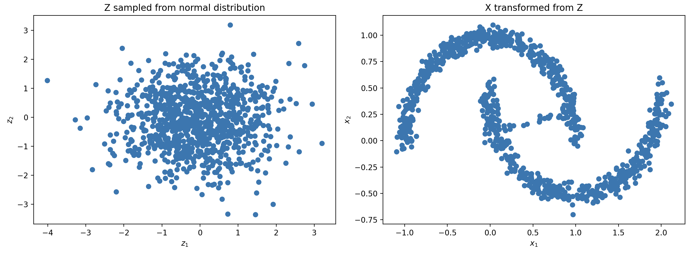
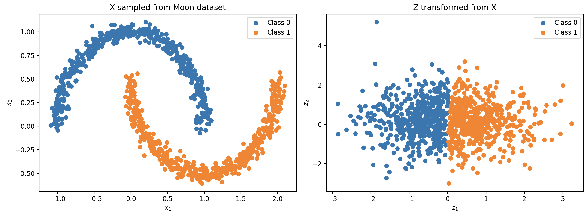
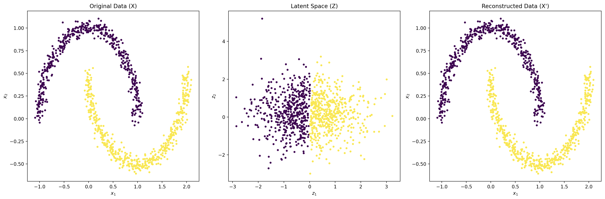
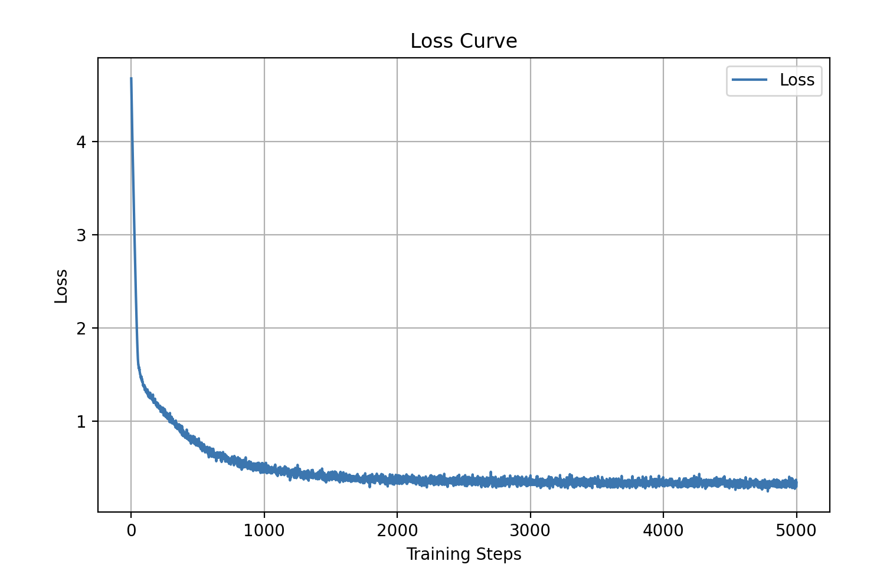
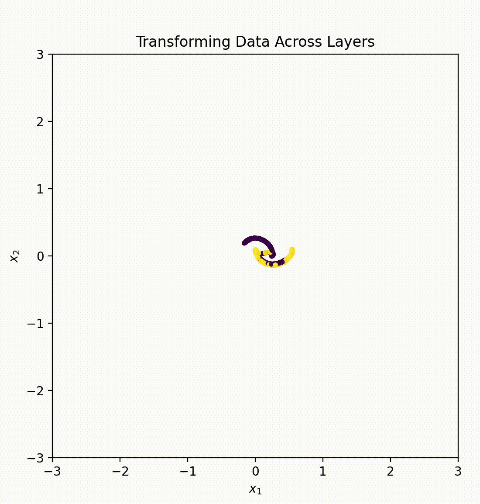

# RealNVP 2D: Normalising Flows for 2-Dimensional Distributions

RealNVP (**Real-valued Non-Volume Preserving Transformations**) is a type of **normalising flow** designed to model complex probability distributions by applying a sequence of invertible transformations. This project implements a **2D RealNVP** model tailored for illustrative datasets like the "moons" dataset, with modular, scalable components for research and experimentation.

---

## Table of Contents

1. [Overview](#overview)
2. [Key Features](#key-features)
3. [Mathematical Foundations](#mathematical-foundations)
4. [Architecture Overview](#architecture-overview)
5. [Visualisations](#visualisations)
6. [License](#license)

---

## Overview

The RealNVP model learns a **bijective mapping** between:
- A **simple base distribution** (e.g., standard Gaussian).
- A **complex target distribution** (e.g., the "moons" dataset).

Using **affine coupling layers**, RealNVP ensures efficient forward and inverse transformations with a tractable Jacobian determinant. The learned mapping allows:
1. Sampling from the complex distribution by transforming samples from the base distribution.
2. Calculating exact likelihoods for any input data point.

---

## Key Features

- **Scalable Normalising Flow**:
  - Arbitrary number of affine coupling layers.
  - Configurable hidden dimensions for scalability.

- **Dynamic Dataset Support**:
  - Easily integrates with `make_moons` or other 2D datasets.

- **Efficient Inverse Transformations**:
  - RealNVP's architecture ensures computationally efficient inverses.

- **Comprehensive Visualisations**:
  - Forward transformations, reverse transformations, reconstruction comparisons, loss curves, and animated transformations.

- **YAML-Based Configuration**:
  - Simplifies experiment tuning and reproducibility.

---

## Mathematical Foundations

### 1. Affine Coupling Transformation

Each affine coupling layer transforms the input `x` into the output `y` as follows:

- **Fixed (masked) variables**:
  y_d = x_d

- **Transformed (unmasked) variables**:
  y_u = x_u * exp(s(x_d)) + t(x_d)

Where:
- x_d and x_u are subsets of the input split by a binary mask.
- s(x_d) and t(x_d) are scaling and translation factors, computed by neural networks.

---

### 2. Log-Determinant of the Jacobian

The Jacobian determinant of the transformation is:

logdet = sum(log(exp(s(x_d))))

This ensures the log-likelihood can be computed efficiently.

---

### 3. Base Distribution

The latent space (z) is modelled as a standard Gaussian:
p_Z(z) = (1 / sqrt(2 * pi)) * exp(-0.5 * ||z||^2)

---

### 4. Loss Function

The negative log-likelihood loss is:

L = log(2 * pi) + E_x [ 0.5 * ||z||^2 - log |det(dz/dx)| ]

---

## Architecture Overview

The RealNVP 2D model leverages **normalising flows** to learn bijective mappings between a target distribution and a simpler base distribution (e.g., standard Gaussian). The core of the architecture is the **Affine Coupling Layer**, supported by modular components for masking, scaling, and translation.

### 1. Affine Coupling Layer

The AffineCouplingLayer is the central building block of the RealNVP architecture. It transforms the input `x` to output `y` using an affine transformation:

- **Masked Variables (x_d)**: Remain unchanged.
- **Unmasked Variables (x_u)**: Transformed using:
  y_u = x_u * exp(s(x_d)) + t(x_d)

The key components:
- **Masking**: Separates input variables into fixed (x_d) and transformed (x_u) subsets using the MaskBlock.
- **Scaling (s(x_d))**: A neural network (ScaleBlock) computes the scaling factor.
- **Translation (t(x_d))**: Another neural network (TranslationBlock) computes the translation offset.

#### Forward Transformation (x -> y):
- Inputs are masked using the binary mask (x * mask).
- Scaling and translation are applied to unmasked variables:
  y = x_d + x_u * exp(s(x_d)) + t(x_d)
- The log-determinant of the Jacobian is computed as:
  logdet = sum(log(exp(s(x_d))))

#### Inverse Transformation (y -> x):
- Reverse the affine transformation:
  x_u = (y_u - t(x_d)) * exp(-s(x_d))

---

### 2. MaskBlock

The MaskBlock applies a binary mask to the input:
- Mask value of 1: Variable remains unchanged.
- Mask value of 0: Variable undergoes transformation.

The mask alternates across coupling layers to ensure all variables are eventually transformed. For a 2D input, typical masks might look like:
- Layer 1: [1, 0]
- Layer 2: [0, 1]

---

### 3. ScaleBlock

The ScaleBlock is a feed-forward neural network that computes the scaling factor s(x_d) for the unmasked variables. The network structure:
- Input: Masked variables (x_d).
- Hidden Layers: Fully connected layers with ReLU activations.
- Output: Scaling factors.

The scaling factors are element-wise multiplied with the unmasked variables:
x_u * exp(s(x_d))

---

### 4. TranslationBlock

The TranslationBlock is another feed-forward neural network that computes the translation t(x_d). The network structure is similar to ScaleBlock:
- Input: Masked variables (x_d).
- Hidden Layers: Fully connected layers with ReLU activations.
- Output: Translation offsets.

The translation is added to the scaled unmasked variables:
x_u * exp(s(x_d)) + t(x_d)

---

### 5. RealNVP2D

The RealNVP2D class is the complete implementation of the RealNVP model. It stacks multiple affine coupling layers and applies a normalisation layer to bound the outputs.

#### Normalisation Layer
A tanh-based normalisation ensures the transformed variables remain bounded:
y = 4 * tanh(x)
The corresponding Jacobian determinant adjustment is:
logdet = sum(log(4 * (1 - tanh(x)^2)))

#### Forward Pass (x -> z):
1. Pass input x through a sequence of affine coupling layers.
2. Normalise the outputs using the tanh-based normalisation layer.

#### Inverse Pass (z -> x):
1. Reverse the normalisation layer.
2. Pass the outputs through the affine coupling layers in reverse order.

---

### Example Flow Through the Architecture

1. **Input (x)**:
   - A sample from the target distribution (e.g., "moons").

2. **Affine Coupling Layers**:
   - Apply alternating transformations using masks:
     - Mask 1: [1, 0]
     - Mask 2: [0, 1]
   - Compute scaling (s(x_d)) and translation (t(x_d)) for the unmasked variables.

3. **Normalisation**:
   - Transform outputs to a bounded range using tanh.

4. **Latent Space (z)**:
   - Outputs are mapped to a standard Gaussian distribution.

---

### Summary of Key Steps

- **Forward Transformation (x -> z)**:
  - Maps the data from the target distribution to the latent space.
  - Includes affine coupling layers and normalisation.
  - Log-determinants are accumulated for likelihood calculations.

- **Inverse Transformation (z -> x)**:
  - Maps latent space samples back to the data space.
  - Inverts affine transformations and normalisation.

- **Log-Likelihood**:
  - The log-likelihood of data is computed as:
    log p(x) = log p(z) + log |det(dz/dx)|
  - Efficient computation is enabled by the affine coupling design.

---

## Visualisations

